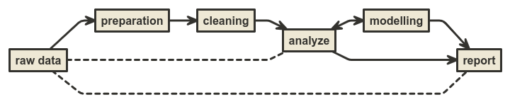

```{r setup, include=FALSE}
knitr::opts_chunk$set(echo = TRUE)
options(scipen = 999)
setwd("~/Data-Science-101/Materi Minggu 0/Kunci Jawaban")
rm(list=ls())
```

_Hi All_,

Bagaimana tugas di `minggu 0` ini? Seberapa menantang tugas ini buat kalian?

Sebagai informasi, data ini adalah secuplik dari _data real_ dan _real problem_ yang saya hadapi di pekerjaan sehari-hari.

Di dunia nyata, kalian akan banyak berhadapan dengan data yang __tidak bersih__ alias __kotor__. Sangat jarang data yang kalian miliki bisa langsung dianalisa atau dibuat _report_-nya. Percaya atau tidak, hampir `80%` pekerjaan terkait data dihabiskan untuk _preparing_ dan _cleaning_ data.

```{r,echo=FALSE}

```

Biasanya, berikut adalah beberapa langkah yang saya lakukan dalam bekerja dengan __R__:

```{r,echo=FALSE}
knitr::include_graphics("https://raw.githubusercontent.com/ikanx101/Live-Session-Nutrifood-R/master/readme_files/figure-gfm/unnamed-chunk-1-1.png")
```

---

Sekarang mari kita selesaikan masalah dari data ini, yakni:

1. Pada rentang waktu tersebut, siapa yang menjadi _market leader_?
1. _Brand_ minyak mana yang memiliki _sales value_ terbesar saat __big sale__ `9.9`?
1. Bayangkan kalian bekerja di salah satu _brand_ minyak tersebut, dari data ini hal apa yang bisa Anda sarankan ke tim _sales / marketing_?

# Langkah I

## Deskripsi dari Data

_Dataset pre test_ ini bernama `raw data.csv`, yakni berisi data hasil penjualan produk di kategori `minyak zaitun` di salah satu _marketplace_ ternama di Indonesia pada rentang waktu tertentu.

_Dataset_ terdiri dari `5` variabel, yakni:

1. `nama` produk.
1. `harga` yang terpampang di _marketplace_.
1. Nama `seller`.
1. Qty `terjual` mulai dari pertama kali produk _listed_ di _marketplace_ sampai tanggal pengambilan data.
1. `tanggal_ambil_data`, waktu data diambil.

## _Import_ Data

Saya akan _import_ data ini ke _global environment_ di __R__:

```{r}
data = read.csv("~/Data-Science-101/Materi Minggu 0/raw data.csv")
```

## Melihat Struktur Data

Kita cek dulu struktur datanya:

```{r}
str(data)
```

Oke, sekarang kita sudah melihat beberapa __masalah__ pada data tersebut. Mari kita siapkan dan bersihkan data tersebut.

# _Data Preparation_ dan _Data Cleaning_

## Konsistensi Isi Data

Setidaknya ada tiga hal yang harus saya lakukan:

1. Membersikan `terjual`.
1. Membersihkan `harga`.
1. Mengubah `tanggal_ambil_data` dari karakter ke `date` _object_.

Oh iya, untuk melakukannya saya akan gunakan prinsip _tidy_ di _libraries_ terkait.

```{r,warning=FALSE,message=FALSE}
library(dplyr)
library(tidyr)

data = 
  data %>% 
  mutate(tanggal_ambil_data = lubridate::date(tanggal_ambil_data),
         harga = gsub("[A-z]|\\.","",harga),
         harga = as.numeric(harga),
         terjual = gsub("[A-z]|\\.","",terjual),
         terjual = as.numeric(terjual)) %>% 
  rename(tanggal = tanggal_ambil_data) %>% 
  select(-X)
```

Kita lihat hasilnya:

```{r,echo=FALSE}
knitr::kable(head(data,10),title = "10 Data Pertama")
```

## Mengambil Merek Minyak Zaitun

Berikutnya saya akan mengambil merek-merek minyak zaitun. Sayangnya tidak ada cara __otomatis__ untuk melakukan ini. _Best practice_ yang bisa saya lakukan adalah dengan melakukan _regex_ terhadap merek-merek minyak zaitun yg ada di pasaran.

Selain itu, kalau teman-teman menyadari. Ada beberapa produk di luar minyak zaitun yang ikut masuk ke dalam data ini. Ada produk seperti `sambal`, `minyak kemiri`, dan jenis minyak `kecantikan` lainnya. Sedangkan kita hanya ingin melihat _minyak zaitun_ untuk dikonsumsi.

```{r,warning=FALSE,message=FALSE}
data = 
  data %>% 
  mutate(merek = 'Lainnya',
         merek = ifelse(grepl('bertolli',nama,ignore.case = T),'Bertolli',merek),
         merek = ifelse(grepl('borges',nama,ignore.case = T),'Borges',merek),
         merek = ifelse(grepl('rafael|salgado|refael|rs',nama,ignore.case = T),'Rafael Salgado',merek),
         merek = ifelse(grepl('riche',nama,ignore.case = T),'Le Riche',merek),
         merek = ifelse(grepl('Evoo|casa di',nama,ignore.case = T),'Evoo Casa di Oliva Olivia',merek),
         merek = ifelse(grepl('Filippo|berio|fillipo',nama,ignore.case = T),'Filippo Berio',merek),
         merek = ifelse(grepl('Pietro',nama,ignore.case = T),'Pietro Coricelli',merek),
         merek = ifelse(grepl('hni|hpai',nama,ignore.case = T),'HNI HPAI',merek),
         merek = ifelse(grepl('ecozest',nama,ignore.case = T),'Ecozest',merek),
         merek = ifelse(grepl('costa',nama,ignore.case = T),'Costa d Oro',merek),
         merek = ifelse(grepl('dougo',nama,ignore.case = T),'Dougo',merek),
         merek = ifelse(grepl('espanola',nama,ignore.case = T),'Espanola',merek),
         merek = ifelse(grepl('mueloliva',nama,ignore.case = T),'Mueloliva',merek)
  ) %>% 
  filter(
    !grepl('kemiri',nama,ignore.case = T),
    !grepl('sambal',nama,ignore.case = T),
    !grepl('relax',nama,ignore.case = T)
  )
```

Apakah sudah selesai?

> Belum donk...!

## Membersihkan Jualan Harian

Kalau kalian perhatikan, variabel _qty_ `terjual` mulai dari pertama kali produk _listed_ di _marketplace_ sampai tanggal pengambilan data. Maka untuk mendapatkan jualan harian, kita harus menjadikan tanggal pertama di data: `r min(data$tanggal)` sebagai basis (titik nol).

Kalau kalian perhatikan, beberapa _seller_ tidak memiliki data yang lengkap di semua tanggal data. Oleh karena itu, akan kita lengkapi terlebih dahulu tanggalnya. Lalu data yang `NA` tersebut akan kita isi dengan data jualan di hari sebelumnya.

---

Bingung?

Begini ilustrasinya:

Misal pada hari `1`, toko X menjual 10 produk. Tiba-tiba data yang _available_ utk toko X baru ada di hari ke `4`. Maka jualan toko X pada hari ke `2` dan `3` akan diisi data jualan pada hari `1`.

---

Prinsipnya:

> Jualan `qty` pada hari $n+1$ tidak boleh lebih kecil dibandingkan hari ke $n$.


```{r,warning=FALSE,message=FALSE}
tes = data %>% select(nama,seller) %>% distinct()

tanggal = seq(min(data$tanggal),max(data$tanggal),by = 1)

dbase = data.frame(nama = c(1:(length(tanggal)*461)),
                   seller = 1,
                   tanggal = as.Date('1/1/2020')
)
z = 1
for(i in 1:461){
  for(j in 1:length(tanggal)){
    dbase$nama[z] = tes$nama[i]
    dbase$seller[z] = tes$seller[i]
    dbase$tanggal[z] = tanggal[j]
    z = z+1
  }
}
####################
data = merge(dbase,data,all.x = T)
data = distinct(data)

```

Sekarang kita hitung selisih jualan `qty` hariannya:

```{r,warning=FALSE,message=FALSE}
data = 
  data %>% 
  arrange(nama,seller,tanggal) %>% 
  fill(harga,terjual,merek,.direction = "down") %>% 
  mutate(id = c(1:length(nama)))

for(ikanx in 1:length(tanggal)){
  data = 
    data %>% 
    group_by(seller,nama) %>% 
    mutate(diff_terjual = c(0,diff(terjual)),
           diff_harga = c(0,diff(harga))) 
  
  for(i in 2:length(data$nama)){
    data$terjual[i] = ifelse(data$diff_terjual[i] < 0,
                             data$terjual[i-1],
                             data$terjual[i])
  }
}

data = 
  data %>% 
  group_by(seller,nama) %>% 
  mutate(diff_terjual = c(0,diff(terjual)),
         diff_harga = c(0,diff(harga))) %>% 
  ungroup() %>% 
  mutate(omset = diff_terjual * harga) %>% 
  select(-id)
  
```

_Nah_, sekarang datanya sudah bersih!

---

# Jawaban Pertanyaan

## Jawaban I

Siapa _market leader_?

```{r,echo=FALSE,message=FALSE,warning=FALSE,fig.retina=10}
library(ggplot2)

data %>% 
  group_by(merek) %>% 
  summarise(omset = sum(omset)) %>% 
  ungroup() %>% 
  mutate(label = round(omset/1000000,1),
         label = paste0("Rp",label," juta")) %>% 
  ggplot(aes(x = reorder(merek,omset),
             y = omset)) +
  geom_col() +
  geom_label(aes(label = label),
             size = 2,
             hjust = .5) +
  coord_flip() +
  labs(title = "Siapa market leader pada periode ini?",
       subtitle = "sumber: data hasil scrape",
       caption = "Scraped and Visualized\nusing R\nikanx101.com") +
  theme_minimal() +
  theme(axis.title = element_blank(),
        axis.text.x = element_blank())
```

## Jawaban II

Siapa yang memiliki _sales value_ terbesar pada `9.9`?

```{r,echo=FALSE,message=FALSE,warning=FALSE,fig.retina=10,fig.height=8}
data %>% 
  group_by(tanggal,merek) %>% 
  summarise(omset = sum(omset)) %>% 
  ggplot(aes(x = tanggal,
             y = omset)) +
  geom_line(aes(color = merek)) +
  facet_wrap(~merek,ncol = 2,scales = "free") +
  theme_minimal() +
  theme(legend.position = "none",
        axis.title = element_blank()) +
  labs(title = "Siapa yang menang di 9.9?",
       subtitle = "sumber: data hasil scrape",
       caption = "Scraped and Visualized\nusing R\nikanx101.com")
```

## Jawaban III

Gimana strategi untuk _brand_ kamu?

```{r,echo=FALSE,message=FALSE,warning=FALSE,fig.retina=10}
korelasi = 
  data %>% 
  group_by(merek) %>% 
  summarise(banyak_listed = length(unique(nama)),
            banyak_seller = length(unique(seller)),
            omset = sum(omset)) %>% 
  ungroup() %>% 
  select(-merek) 

corrplot::corrplot(cor(korelasi),
                   method="circle",
                   type="upper",
                   addCoef.col = "white",
                   tl.col="black",
                   tl.srt = 20)
```

Ada yang bisa kita simpulkan?