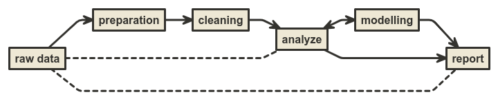
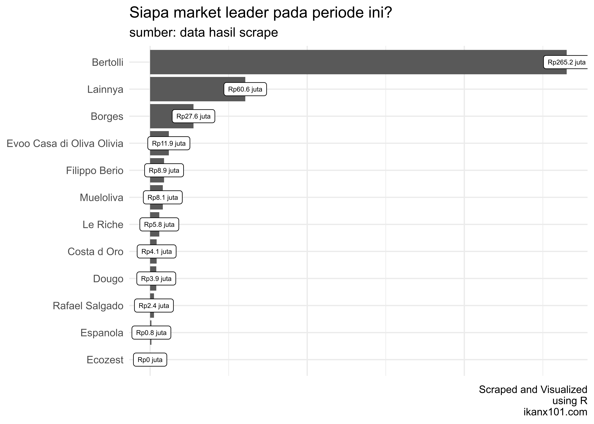

Solving Olive Oil Problem
================
Ikang Fadhli
30 Oktober 2020

*Hi All*,

Bagaimana tugas di `minggu 0` ini? Seberapa menantang tugas ini buat
kalian?

Sebagai informasi, data ini adalah secuplik dari *data real* dan *real
problem* yang saya hadapi di pekerjaan sehari-hari.

Di dunia nyata, kalian akan banyak berhadapan dengan data yang **tidak
bersih** alias **kotor**. Sangat jarang data yang kalian miliki bisa
langsung dianalisa atau dibuat *report*-nya. Percaya atau tidak, hampir
`80%` pekerjaan terkait data dihabiskan untuk *preparing* dan *cleaning*
data.



Biasanya, berikut adalah beberapa langkah yang saya lakukan dalam
bekerja dengan **R**:

<!-- -->

-----

Sekarang mari kita selesaikan masalah dari data ini, yakni:

1.  Pada rentang waktu tersebut, siapa yang menjadi *market leader*?
2.  *Brand* minyak mana yang memiliki *sales value* terbesar saat **big
    sale** `9.9`?
3.  Bayangkan kalian bekerja di salah satu *brand* minyak tersebut, dari
    data ini hal apa yang bisa Anda sarankan ke tim *sales / marketing*?

# Langkah I

## Deskripsi dari Data

*Dataset pre test* ini bernama `raw data.csv`, yakni berisi data hasil
penjualan produk di kategori `minyak zaitun` di salah satu *marketplace*
ternama di Indonesia pada rentang waktu tertentu.

*Dataset* terdiri dari `5` variabel, yakni:

1.  `nama` produk.
2.  `harga` yang terpampang di *marketplace*.
3.  Nama `seller`.
4.  Qty `terjual` mulai dari pertama kali produk *listed* di
    *marketplace* sampai tanggal pengambilan data.
5.  `tanggal_ambil_data`, waktu data diambil.

## *Import* Data

Saya akan *import* data ini ke *global environment* di **R**:

``` r
data = read.csv("~/Data-Science-101/Materi Minggu 0/raw data.csv")
```

## Melihat Struktur Data

Kita cek dulu struktur datanya:

``` r
str(data)
```

    ## 'data.frame':    3259 obs. of  6 variables:
    ##  $ X                 : int  1 2 3 4 5 6 7 8 9 10 ...
    ##  $ nama              : chr  "Bertolli Extra Virgin Olive Oil / Minyak Zaitun Murni 500 ML BEST SELL" "Original Extra Virgin Olive Oil (EVOO) Casa Di Olivia Zaitun For Kids" "EVOO Baby Olive Oil Casa Di Oliva Olivia For Kids Bayi Minyak Zaitun" "Casa di Oliva - Extra Virgin Olive Oil for Kids (EVOO) 250ml" ...
    ##  $ harga             : chr  "Rp85.000" "Rp60.000" "Rp58.000" "Rp59.000" ...
    ##  $ seller            : chr  "Food Republic" "Yubyre" "Papamama Babyshop" "Chubby Baby Shop" ...
    ##  $ terjual           : chr  "Terjual 1.779 Produk" "Terjual 1.624 Produk" "Terjual 2.161 Produk" "Terjual 1.696 Produk" ...
    ##  $ tanggal_ambil_data: chr  "2020-09-04" "2020-09-04" "2020-09-04" "2020-09-04" ...

Oke, sekarang kita sudah melihat beberapa **masalah** pada data
tersebut. Mari kita siapkan dan bersihkan data tersebut.

# *Data Preparation* dan *Data Cleaning*

## Konsistensi Isi Data

Setidaknya ada tiga hal yang harus saya lakukan:

1.  Membersikan `terjual`.
2.  Membersihkan `harga`.
3.  Mengubah `tanggal_ambil_data` dari karakter ke `date` *object*.

Oh iya, untuk melakukannya saya akan gunakan prinsip *tidy* di
*libraries* terkait.

``` r
library(dplyr)
library(tidyr)

data = 
  data %>% 
  mutate(tanggal_ambil_data = lubridate::date(tanggal_ambil_data),
         harga = gsub("[A-z]|\\.","",harga),
         harga = as.numeric(harga),
         terjual = gsub("[A-z]|\\.","",terjual),
         terjual = as.numeric(terjual)) %>% 
  rename(tanggal = tanggal_ambil_data) %>% 
  select(-X)
```

Kita lihat hasilnya:

| nama                                                                   |  harga | seller            | terjual | tanggal    |
| :--------------------------------------------------------------------- | -----: | :---------------- | ------: | :--------- |
| Bertolli Extra Virgin Olive Oil / Minyak Zaitun Murni 500 ML BEST SELL |  85000 | Food Republic     |    1779 | 2020-09-04 |
| Original Extra Virgin Olive Oil (EVOO) Casa Di Olivia Zaitun For Kids  |  60000 | Yubyre            |    1624 | 2020-09-04 |
| EVOO Baby Olive Oil Casa Di Oliva Olivia For Kids Bayi Minyak Zaitun   |  58000 | Papamama Babyshop |    2161 | 2020-09-04 |
| Casa di Oliva - Extra Virgin Olive Oil for Kids (EVOO) 250ml           |  59000 | Chubby Baby Shop  |    1696 | 2020-09-04 |
| BEST PRICE CASA DI OLIVA EXTRA VIRGIN OLIVE OIL FOR KIDS               |  59900 | Whiz World        |    3115 | 2020-09-04 |
| Minyak Zaitun BORGES Extra Virgin Olive Oil 500 ml - BORGES 500ml      |  83500 | Lapak Barokah     |    1337 | 2020-09-04 |
| Bertolli Extra Light dan Classico Olive Oil 1000ml - Classico          | 155000 | ceva              |    1149 | 2020-09-04 |
| Minyak Zaitun Olive Oil 500ml Asli Tanpa Campuran                      |  59000 | herbalasli        |    2375 | 2020-09-04 |
| Minyak Zaitun Extra Virgin Olive Oil Bertolli 1 LTR                    | 163000 | Food Republic     |    1282 | 2020-09-04 |
| Borges Extra Virgin Olive Oil Minyak Zaitun 500 ml                     |  98000 | HouseHerbal       |     777 | 2020-09-04 |

## Mengambil Merek Minyak Zaitun

Berikutnya saya akan mengambil merek-merek minyak zaitun. Sayangnya
tidak ada cara **otomatis** untuk melakukan ini. *Best practice* yang
bisa saya lakukan adalah dengan melakukan *regex* terhadap merek-merek
minyak zaitun yg ada di pasaran.

Selain itu, kalau teman-teman menyadari. Ada beberapa produk di luar
minyak zaitun yang ikut masuk ke dalam data ini. Ada produk seperti
`sambal`, `minyak kemiri`, dan jenis minyak `kecantikan` lainnya.
Sedangkan kita hanya ingin melihat *minyak zaitun* untuk dikonsumsi.

``` r
data = 
  data %>% 
  mutate(merek = 'Lainnya',
         merek = ifelse(grepl('bertolli',nama,ignore.case = T),'Bertolli',merek),
         merek = ifelse(grepl('borges',nama,ignore.case = T),'Borges',merek),
         merek = ifelse(grepl('rafael|salgado|refael|rs',nama,ignore.case = T),'Rafael Salgado',merek),
         merek = ifelse(grepl('riche',nama,ignore.case = T),'Le Riche',merek),
         merek = ifelse(grepl('Evoo|casa di',nama,ignore.case = T),'Evoo Casa di Oliva Olivia',merek),
         merek = ifelse(grepl('Filippo|berio|fillipo',nama,ignore.case = T),'Filippo Berio',merek),
         merek = ifelse(grepl('Pietro',nama,ignore.case = T),'Pietro Coricelli',merek),
         merek = ifelse(grepl('hni|hpai',nama,ignore.case = T),'HNI HPAI',merek),
         merek = ifelse(grepl('ecozest',nama,ignore.case = T),'Ecozest',merek),
         merek = ifelse(grepl('costa',nama,ignore.case = T),'Costa d Oro',merek),
         merek = ifelse(grepl('dougo',nama,ignore.case = T),'Dougo',merek),
         merek = ifelse(grepl('espanola',nama,ignore.case = T),'Espanola',merek),
         merek = ifelse(grepl('mueloliva',nama,ignore.case = T),'Mueloliva',merek)
  ) %>% 
  filter(
    !grepl('kemiri',nama,ignore.case = T),
    !grepl('sambal',nama,ignore.case = T),
    !grepl('relax',nama,ignore.case = T)
  )
```

Apakah sudah selesai?

> Belum donk…\!

## Membersihkan Jualan Harian

Kalau kalian perhatikan, variabel *qty* `terjual` mulai dari pertama
kali produk *listed* di *marketplace* sampai tanggal pengambilan data.
Maka untuk mendapatkan jualan harian, kita harus menjadikan tanggal
pertama di data: 2020-09-04 sebagai basis (titik nol).

Kalau kalian perhatikan, beberapa *seller* tidak memiliki data yang
lengkap di semua tanggal data. Oleh karena itu, akan kita lengkapi
terlebih dahulu tanggalnya. Lalu data yang `NA` tersebut akan kita isi
dengan data jualan di hari sebelumnya.

-----

Bingung?

Begini ilustrasinya:

Misal pada hari `1`, toko X menjual 10 produk. Tiba-tiba data yang
*available* utk toko X baru ada di hari ke `4`. Maka jualan toko X pada
hari ke `2` dan `3` akan diisi data jualan pada hari `1`.

-----

Prinsipnya:

> Jualan `qty` pada hari
>  tidak boleh
> lebih kecil dibandingkan hari ke
> .

``` r
tes = data %>% select(nama,seller) %>% distinct()

tanggal = seq(min(data$tanggal),max(data$tanggal),by = 1)

dbase = data.frame(nama = c(1:(length(tanggal)*461)),
                   seller = 1,
                   tanggal = as.Date('1/1/2020')
)
z = 1
for(i in 1:461){
  for(j in 1:length(tanggal)){
    dbase$nama[z] = tes$nama[i]
    dbase$seller[z] = tes$seller[i]
    dbase$tanggal[z] = tanggal[j]
    z = z+1
  }
}
####################
data = merge(dbase,data,all.x = T)
data = distinct(data)
```

Sekarang kita hitung selisih jualan `qty` hariannya:

``` r
data = 
  data %>% 
  arrange(nama,seller,tanggal) %>% 
  fill(harga,terjual,merek,.direction = "down") %>% 
  mutate(id = c(1:length(nama)))

for(ikanx in 1:length(tanggal)){
  data = 
    data %>% 
    group_by(seller,nama) %>% 
    mutate(diff_terjual = c(0,diff(terjual)),
           diff_harga = c(0,diff(harga))) 
  
  for(i in 2:length(data$nama)){
    data$terjual[i] = ifelse(data$diff_terjual[i] < 0,
                             data$terjual[i-1],
                             data$terjual[i])
  }
}

data = 
  data %>% 
  group_by(seller,nama) %>% 
  mutate(diff_terjual = c(0,diff(terjual)),
         diff_harga = c(0,diff(harga))) %>% 
  ungroup() %>% 
  mutate(omset = diff_terjual * harga) %>% 
  select(-id)
```

*Nah*, sekarang datanya sudah bersih\!

-----

# Jawaban Pertanyaan

## Jawaban I

Siapa *market leader*?



## Jawaban II

Siapa yang memiliki *sales value* terbesar pada `9.9`?


