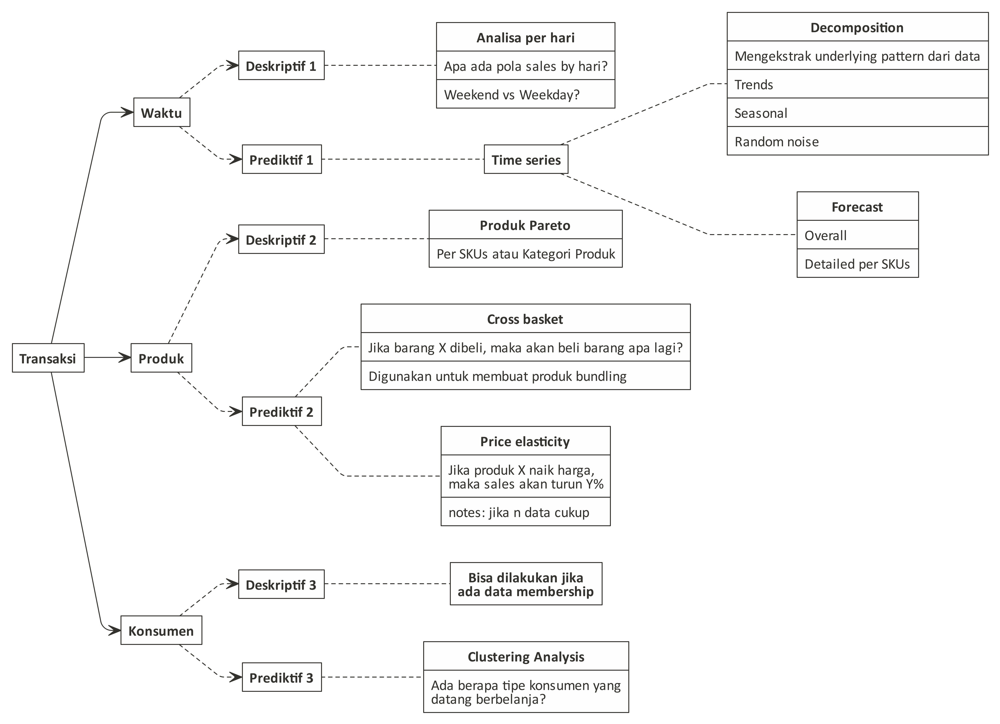

```{r setup, include=FALSE}
knitr::opts_chunk$set(echo = TRUE)
setwd("~/Documents/Data-Science-101/Materi Minggu 2")
rm(list=ls())
```

## _Dear All_,

Pada minggu kedua ini saya akan memberikan satu _folder_ berisi data-data detail transaksi yang ada di kasir suatu minimarket.

---

## Pendahuluan

### Latar Belakang

Beberapa teman SMA saya patungan membuat suatu koperasi yang dijadikan minimarket di suatu perumahaan di Kabupaten Bekasi. Minimarket itu menjual semua barang kebutuhan sehari-hari layaknya minimarket besar yang telah dikenal banyak orang (Alfamart dan Indomaret).

Kali ini, mereka memberikan kepada saya data detail transaksi perhari selama `4` bulan di awal tahun 2020.

### Deskripsi Data

Data terdiri dari `4` _excel files_ yang memuat informasi sebagai berikut:

1. Waktu transaksi (hari dan jam).
1. Tipe konsumen (member atau non member).
1. Barang yang dibelanjakan per konsumen (dilihat dari `transaction id`).

Data bisa diambil di [_link_](https://drive.google.com/drive/folders/1BIQjDgSCL2GFFyPZJD14sdr1pZb_My4D?usp=sharing) berikut!
---

# Tugas Kalian

Sebagaimana yang telah saya informasikan pada minggu pertama. Data transaksi itu bisa dianalogikan seperti peta harta karun yang kaya dengan informasi.

Setidaknya, saya bisa melakukan beberapa hal seperti:

```{r,echo=FALSE}

```

Tentunya ada banyak hal lain yang bisa dilakukan selain apa yang ditulis dalam bagan di atas.

## Tugas Wajib Pilihan

Sekarang kalian akan dibagi menjadi tim berisi `2` orang. Kalian wajib memilih satu diantara `3` kasus berikut ini untuk dipecahkan:

### Kasus I: PSBB

> Teman saya menduga bahwa ada perubahan habit belanja pada saat PSBB dilakukan.

Konfirmasi dugaan teman saya tersebut dengan menganalisa data yang ada. Berikan saran jika memungkinkan!

### Kasus II: Promo Member

> Teman saya memiliki ide untuk memberikan program referal belanja untuk member. Jadi member punya anggaran untuk memberikan voucher per bulan untuk kenalannya (non member) yang nanti belanja di minimarket. Setiap member melakukan pembelanja minimal Rp80.000 akan mendapatkan voucher Rp10.000 yang bisa diberikan kepada orang lain (non member). 

Berikan saran terhadap ide teman saya tersebut!

### Kasus III: Promo Bundling

> Teman saya ingin membuat paket bundling dari beberapa produk. Tujuannya untuk memaksimalkan omset. Syukur-syukur bisa membuat bundling dari produk yang slow moving ditempel ke produk yang fast moving.

Apakah kita bisa memberikan saran produk bundling apa saja yang bisa dijual?

## Tugas Lainnya

Selain tugas yang wajib dipilih di atas. Kalian boleh melakukan analisa apapun dari data ini. Ingat! Data ini sangat kaya dengan _insights_.

Apa perbedaan _insights_ dengan _informations_?

Perbedaan mendasar adalah _insights_ itu memiliki faktor _call to action_ dalam bisnis.

Jadi, silakan melakukan analisa yang menurut kalian menarik dan memiliki _insights_.

---

# Presentasi

Presentasi tugas wajib akan dilakukan bergilir mulai dari tanggal `14 November 2020` sampai beberapa minggu ke depan.

Setiap kelompok memiliki waktu `30` menit. Kelompok lainnya boleh memberikan komentar dan pertanyaan terhadap kelompok yang sedang melakukan rpesentasi.

Kita akan habiskan dulu semua _insights_ dari data ini baru akan berganti ke data lainnya _yah_.